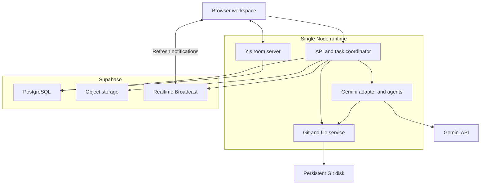
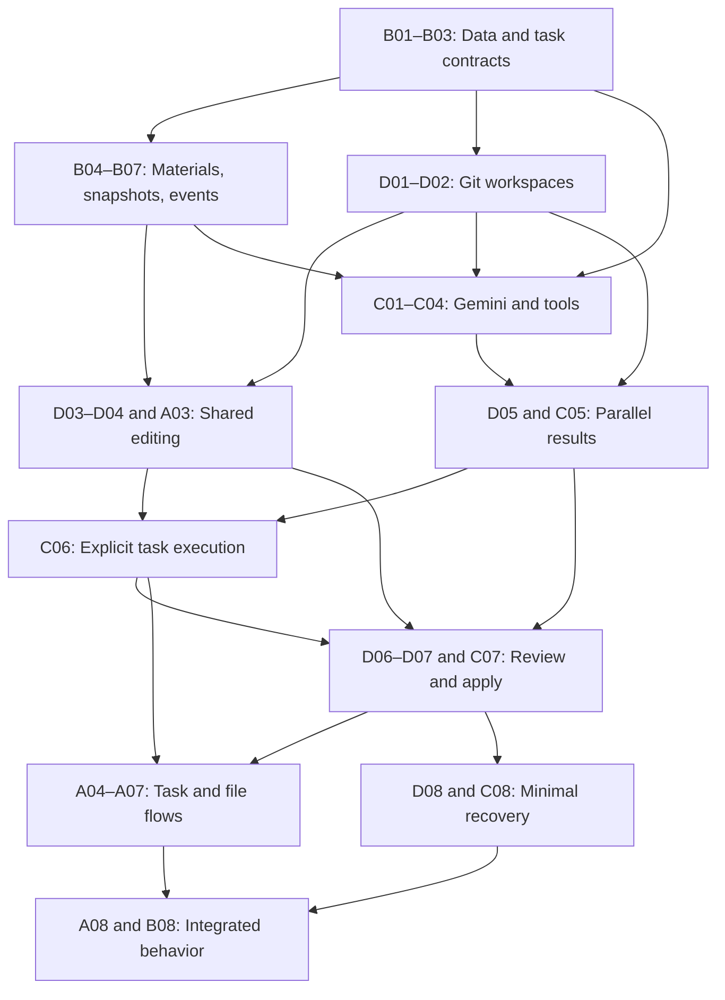

# Collaborative Task Workspace
## MVP design blueprint

Revised September 12, 2026.

## Summary

Build a web workspace where anonymous collaborators create tasks, discuss requirements, upload materials, and edit text documents together. Posting a task does not start agents. A separate Start task action captures the agreed requirements and current draft, then an internal orchestrator assigns work to parallel agents.

The creator owns the workspace and shares a contribution link. No accounts, login flow, member directory, or Supabase identity service is involved. A browser-held owner key distinguishes the creator for owner-only actions; everyone with the contribution link can otherwise participate.

The MVP supports Markdown, plain text, and code files. Git supplies checkpoints, isolated agent branches, differences, conflicts, and reviewed application to approved files. Yjs supplies simultaneous typing in shared drafts. Agents do not edit the live human document directly or execute generated code.

Supabase is the primary managed backend for PostgreSQL, uploaded materials, collaborative-document snapshots, and task event delivery. A small Node service hosts the API, coordinator, Yjs connection server, and Git operations; Git repositories require a persistent filesystem outside Supabase's database and object-storage services.

Gemini Pro handles orchestration and Gemini Flash handles worker assignments through the Google GenAI SDK. Models can be switched in backend configuration, without frontend settings. Every agent has its own cumulative token budget within each task and a fixed ten-minute execution deadline. Token usage on one task does not reduce its budget on another task. There is no fixed product cap on active tasks or agent count.

| Area | MVP behavior |
|---|---|
| Entry | Guest creates a workspace; others open its contribution link |
| Ownership | Creator's browser retains an owner key |
| Task creation | Post title, outcome, acceptance criteria, and materials |
| Before execution | Discuss, revise requirements, and edit shared drafts |
| Agent start | Explicit Start task action |
| Human collaboration | Simultaneous typing, visible cursors, task-local discussion |
| Agent collaboration | Orchestrator creates a dependency graph; eligible workers run in parallel |
| File isolation | Human draft, worker branches, and approved files remain distinct |
| Publication | Owner reviews the exact combined candidate and applies it |
| Materials | Upload to workspace or task; attach files to task discussion |
| Model routing | Higher-capability Gemini for orchestration; lower-cost Gemini for workers |
| Agent stopping rules | Per-task, per-agent token budget and fixed ten-minute timeout |
| Recovery | Saved edits/checkpoints, explicit interrupted state, manual retry |
| Included file behavior | Text/code editing, previews, diffs, version history, conflicts |
| File execution | Generated code is not executed |

The design below specifies the MVP's behavior, data ownership, component contracts, and individually assigned implementation tasks.

## 1. Product structure

### 1.1 Workspace

A workspace contains:
- Approved files.
- Posted tasks and their discussions.
- Collaborative drafts associated with tasks.
- Shared reference materials.
- Agent assignments and progress.
- Review candidates and approved history.
- Owner-controlled workspace guidance.

A workspace is a shared collection of work, not a personal terminal or virtual machine. External messaging tools remain outside this application's flow.

One workspace corresponds to one internally managed Git repository. Participants never need Git or GitHub accounts.

Creating a workspace writes its database record and then signals the Git service to initialize its repository. The signal is a hook, not an inline call: repository creation must not be able to fail a workspace creation request, and the data layer must not depend on the Git service being present. The Git service additionally ensures the repository exists on first access, under the workspace operation lock. A workspace whose repository was never initialized, because the hook failed or predates the Git service, therefore repairs itself rather than staying broken.

### 1.2 Anonymous participation and creator ownership

Creating a workspace returns:
- A random workspace identifier.
- A contribution URL containing that identifier.
- A random owner key, returned once to the creating browser.

The server stores only the owner-key hash. The creating browser stores the key locally and sends it only for owner operations. It never appears in the shared URL, document content, model context, or realtime event payload.

Opening the contribution URL directly opens the workspace. There is no invitation acceptance, identity registration, membership record, or participant directory.

The owner key is a minimal operation-level permission check needed to preserve creator-only approval. It is not an account system. Without such a check, the server could not distinguish the creator and owner-only controls would be visual only.

Ownership belongs to possession of that browser key, not a verified person. Clearing browser storage loses owner control; copying the key transfers that control. No recovery flow for ownership is part of this MVP.

The contribution URL is link access, not private identity-based access. Anyone who receives it can contribute. Do not list workspaces publicly or expose an endpoint returning everyone's workspaces.

**Amended 2026-09-13, alongside the accounts change of 1.2/1.3.** Superseded in the parts that describe the owner key as the ownership mechanism; see `docs/accounts.md`. Three clarifications for what replaced it:

- **"No endpoint returning everyone's workspaces" still holds, exactly.** `GET /api/auth/workspaces` returns the *caller's own* workspaces, from their own membership and their own visit history, and there is still no route anywhere that enumerates the table. The prohibition was against a directory of other people's rooms, and that remains prohibited.
- **A workspace now has a life after creation.** It can be archived and restored (owner), left (any member but the last owner), and deleted permanently (owner, with the name typed back). Deletion removes the row and everything cascading from it, the Git repository, and the stored material objects. Nothing in this document previously described removing a workspace, which meant every workspace ever created was permanent — on a fixed-size database, that is a storage leak rather than a policy.
- **An archived workspace is read-only.** Refused in the same authorization hook that enforces membership, with `WORKSPACE_ARCHIVED` (409) rather than a permission code, because the refusal is about the state of the workspace and not about who is asking.

Unchanged and still load-bearing: ownership is never granted by possession of the workspace URL, and a record that somebody *opened* a workspace grants nothing either — it restores the address, never the access.

### 1.3 Contributor labels

Assign a browser-local random contributor ID and a generated label such as “Guest Cedar” for task discussion and cursor attribution. Guests can edit their own display name through a small name control in the workspace header. Persist the edited name in browser-local storage without changing the contributor ID. Use the updated name for subsequent contributions and live cursor attribution; previously stored contribution labels remain unchanged. Trim names, reject blank values, and render them as plain text.

These are unverified display labels. Never use them to enforce ownership, approve changes, or protect supposedly private tasks.

**Amended 2026-09-13.** A signed-in account's display name replaces the generated guest label everywhere a name is shown — presence, document cursors, discussion attribution, upload attribution — and the rename control is drawn only for a link holder, who has no account name to use. The rule above is unchanged in substance and is why this is safe: the name is still never authority, it has simply stopped contradicting the account the server already verified. The browser-local contributor ID is unaffected.

Presence is limited to cursors/selections in the currently open document. There is no persistent participant list.

### 1.4 Actions

| Action | Contributor with workspace link | Creator with owner key | Agent |
|---|---|---|---|
| Read approved files and materials | Yes | Yes | Selected task context |
| Post tasks and task discussion | Yes | Yes | Questions/results through assigned task only |
| Upload references | Yes | Yes | No general upload operation |
| Edit shared drafts | Yes | Yes | Never directly |
| Revise posted task requirements | Yes | Yes | May propose clarification |
| Start, stop, answer, or manually retry tasks | Yes | Yes | Cannot grant itself a fresh attempt |
| Request changes or prepare a review | Yes | Yes | Can produce a result for review |
| Apply reviewed changes | No | Yes | Never |
| Change workspace guidance/name | No | Yes | Never |
| Write approved Git main | No | Through the apply service | Never |

Anonymous participation means there is no trustworthy “only the original task creator may retry” rule. Task actions are collaborative; owner publication remains the one privileged boundary.

## 2. Task lifecycle

### 2.1 Post a task

The form contains:
- Title.
- Desired outcome.
- Acceptance criteria.
- Selected reference materials.
- Selected approved files or shared drafts.
- Optional intended output paths.

**Approved files are not selectable yet.** `GitService` exposes `readText(path)`
for one known path and no listing, so nothing the API can call will say what is
on the approved branch. The form offers reference materials and shared drafts,
and says plainly that approved files are unavailable rather than showing an
empty category, which would read as "this workspace has approved nothing". A
path can still be typed as an intended output.

The remaining work is smaller than it first appears: `ManagedWorktrees.tree(sha)`
already enumerates a commit as path → blob, for review building. Closing this is
a `GitService` wrapper over it plus a route, not a new Git capability.

The primary form action is Post task. It creates a posted task and opens its discussion. It makes no Gemini request and creates no agent execution.

People can add comments, attach materials, adjust requirements, and edit drafts before deciding to start. Requirement updates use optimistic version checks so two form saves cannot silently overwrite each other.

### 2.2 Start a posted task

Start task is a separate action on the posted task.

The server:
1. Checks the submitted task version and confirms there is no active attempt.
2. Creates the run record, fixing the attempt number, task version, guidance version, and discussion cutoff.
3. Returns a run ID immediately; browser connections are not required to remain open.
4. Captures the requirements, criteria, and selected materials into a context manifest.
5. Flushes acknowledged live edits and creates a Git checkpoint of the human draft.
6. Records approved main and the draft checkpoint as immutable inputs on the run.
7. Creates an orchestrator instance.
8. Obtains and validates an assignment graph.
9. Starts eligible worker agents.

Steps 1 and 2 are one database transaction; the run row itself is the duplicate-start guard, so it is written before the Git checkpoint rather than after. Do not hold that transaction open across capture, planning, or any model call.

Steps 4 onward run after the response. If capture fails or the start snapshot conflicts, the run ends in a terminal state and the task reports it. A failed capture never leaves the task without a run record explaining why.

C06 implements steps 4 onward. Its capture unions explicitly selected inputs with materials attached directly to the task, and reports a selection it cannot capture rather than substituting empty text. A run and its task reach their terminal states in one transaction: ending the run first would leave the task reporting `planning` with nothing behind it, and ending the task first would leave it terminal while the active-run row still blocks every retry. Failure is recorded as a stable code, never provider or filesystem text.

Double-clicks or concurrent Start requests produce one active attempt. Two independent mechanisms enforce this: a per-task idempotency key returns the original run for a replayed request, and a unique active-run constraint rejects a genuinely concurrent second request.

### 2.3 Discussion after start

Task discussion remains available throughout execution.

The discussion cutoff is fixed when the run is created. Entries posted after that point never enter any agent context for that run, including assignments that have not started yet. This is deliberate: a run's inputs are frozen at Start, so no assignment reads a different discussion than the one its plan was built from, and no late comment can silently redirect work already dispatched.

Each discussion entry carries a gap-free per-task sequence number, and the run stores the cutoff sequence. Entries at or below the cutoff are in context; entries above it are not, and the interface labels them “Added after this run started.” To act on a later comment, stop the run and start a revised attempt.

Answers to agent questions are the single exception, and they are not an exception to the rule above: an answer is a reply to a question the run itself asked, routed to the waiting agent through its question record rather than through the discussion context.

A new comment therefore does not silently change an in-flight model request. A contributor can:
- Answer a pending agent question.
- Stop the run and start a revised attempt.
- Request a revision after the result is ready.

A change to task requirements or selected inputs increments the task version. Existing execution may finish, but its result is labeled against the older version and cannot be applied without review against the updated requirements.

### 2.4 State model

| Task state | Meaning | Principal actions |
|---|---|---|
| posted | Available for discussion; agents have not started | Edit requirements, attach inputs, edit drafts, Start |
| planning | Orchestrator is producing assignments | Discuss, cancel |
| working | Worker assignments are executing | Edit human draft, discuss, cancel |
| needs_input | Agent requires clarification | Answer, cancel, retry if deadline expired |
| ready_for_review | Completed outputs and combined result available | Inspect, request changes, owner apply |
| conflict | Changes need explicit resolution | Choose result, edit resolution, request revision |
| incomplete | At least one required agent timed out, exhausted tokens, or failed | Inspect saved work, manual retry |
| interrupted | Server restarted during execution | Inspect checkpoints, manual retry |
| canceled | A contributor stopped execution | Inspect saved work, manual retry |
| completed | Reviewed changes were applied, or no changes were needed | Read result/history, create another task |

Legal task transitions, enforced in the service layer under the task row lock:

| From | May become |
|---|---|
| posted | planning, canceled; manual-edit review may go directly to ready_for_review or conflict |
| planning | working, needs_input, conflict, incomplete, interrupted, canceled |
| working | needs_input, ready_for_review, conflict, incomplete, interrupted, canceled, completed |
| needs_input | working, ready_for_review, conflict, incomplete, interrupted, canceled |
| ready_for_review | conflict, completed, planning, incomplete, canceled |
| conflict | ready_for_review, planning, completed, canceled |
| incomplete | planning, canceled, completed |
| interrupted | planning, canceled, completed |
| canceled | planning |
| completed | nothing; the task is read-only |

Transitions are checked in application code rather than by a database trigger, because a task transition always runs under a held row. Agent instances are the opposite case and do need database-level checks: a late write from an expired instance is a correctness problem, not a sequencing one.

Agent states are separate: pending, running, needs_input, completed, failed, timed_out, token_exhausted, canceled, interrupted.

Task completion is not inferred from a model saying “done.” Required assignments, validated output, and the publication state determine it.

### 2.5 Human-only edits

The Files view offers Edit together. This creates or opens a manual-edit task for the selected file. Its task draft is shared by everyone opening the same editing link.

A manual-edit task does not need agent execution. Contributors can edit it and request review; the owner applies it through the same Git review path. Start agents remains available as a separate action if assistance is wanted.

Use one active manual-edit task per workspace/file, enforced by a database uniqueness rule. Explicitly created tasks can still have separate drafts of that file.

### 2.6 Agent questions

An agent question is a first-class record, not a formatted comment. An agent that needs clarification calls ask_question; the server persists a question record bound to that agent instance and renders it as a task discussion entry so contributors see it in the conversation they are already reading.

A question record holds its agent instance, its run, the discussion entry that displays it, the answering discussion entry once one exists, its status, and its expiry. Status is one of open, answered, expired, or canceled.

- An agent has at most one open question at a time, because it has at most one in-flight model request.
- A question expires at its agent instance deadline. Waiting for a human consumes that agent clock; asking does not extend it.
- Answering records an ordinary discussion entry, links it to the question, and marks the question answered.
- Canceling a run, or the expiry of an agent deadline, resolves its open questions without an answer.

A task reports needs_input while its active run has at least one open question, and leaves that state when no open question remains. The task state is derived from question records rather than set independently, so a task cannot sit in needs_input with nothing to answer.

## 3. File and material model

### 3.1 Approved files

Approved files live on Git main. They can be read, previewed, downloaded, compared with previous versions, or opened in a task draft.

Supported editable formats are UTF-8 Markdown, TXT, and selected code/text extensions, including JavaScript, TypeScript, Python, CSS, HTML, JSON, SQL, YAML, and CSV as text. CSV has no spreadsheet interface.

Markdown uses a text editor with a rendered preview. HTML and code are displayed as inert text, not executed.

### 3.2 Reference materials

Materials are immutable uploaded inputs in Supabase Storage. Store a hash, original filename, byte size, uploader's guest label, and a stable material ID in PostgreSQL.

| Upload location | Result |
|---|---|
| Workspace Files | Shared reference available in task material pickers |
| Task Materials | Reference attached directly to that task |
| Task discussion attachment | Reference linked to the discussion entry and available to that task |

All entry points use the same upload implementation. Reattaching an existing material reuses its ID and bytes.

Upload is multipart/form-data with one file part named file, plus a guestLabel field and optional taskId and discussionEntryId fields that select which of the three locations above applies. Materials are deduplicated by content hash within a workspace, so uploading bytes that already exist returns the existing material rather than storing a second copy; the response status distinguishes the two cases, 201 for a new material and 200 for a reused one.

Materials are UTF-8 text. Section 3.4's validation rules make that a hard constraint rather than a convention: there is no binary path through this system, because agents read materials through a scoped text tool, previews render them as inert text, and "use as editable document" turns one into a collaborative draft.

A material is never served back under its recorded content type. Section 13.3 requires uploaded HTML to render as text, and returning it as text/html from the API origin would be stored cross-site scripting against every workspace sharing that host, so reads respond as plain text with content sniffing disabled and an attachment disposition.

Uploading does not invoke an agent or modify approved files. “Use as editable document” creates a task draft from the text; publication still requires review.

Location affects context selection, not privacy. Everyone with the workspace link can access its materials.

### 3.3 Selected context

Before Start, show the materials and drafts the task will use. Direct task attachments are selected by default. Workspace references are available for explicit selection.

"Selected by default" is a property of the context manifest, not a hidden row. A material attached directly to a task is in that task's context without any explicit selection record, so building the manifest means taking the union of the task's explicit selected inputs and the materials linked to that task. Writing a selection record at attach time would be the obvious alternative and is wrong: a later wholesale replacement of the selected inputs would silently drop the attachment.

The context manifest records:
- Task version and requirements.
- Workspace guidance version.
- Discussion entries up to the run cutoff sequence, fixed at Start.
- Material IDs and content hashes.
- Approved file paths and commit.
- Human draft checkpoint and file hashes.

Agents can request more of the selected text through a scoped read tool. The entire workspace is not automatically repeated in every worker prompt.

Newer material versions use new IDs. Existing running agents retain the captured version unless a human explicitly revises/restarts the task.

### 3.4 Basic file validation

Validate UTF-8, permitted file type, byte size, and path safety. Reject binary data, NUL content, archives, symlinks, and special files.

Retain a simple 1 MiB per-text-file transport limit and a bounded WebSocket payload size to protect parsing and memory. Rate limit workspace creation per client for the same reason: the endpoint is unauthenticated, no endpoint lists workspaces, and each workspace occupies a repository on a fixed-size disk, so unbounded creation is an unrecoverable storage leak rather than a cost question.

These are file, protocol, and storage constraints. They are not extra agent task, retry, or concurrency limits, and section 9.4 still governs agent execution.

Excel editing, office-file conversion, external repository import, and generated-code execution are outside this MVP's implemented surface.

## 4. Frontend and UX

### 4.1 Screens

| Route | Screen | Content |
|---|---|---|
| / | Create workspace | Name, purpose, create action |
| /w/:workspaceId | Task board | Posted work, active work, attention, review, completed |
| /w/:workspaceId/tasks/:taskId | Task detail | Requirements, discussion, materials, drafts, agent progress, review |
| /w/:workspaceId/files | Files | Approved files, reference materials, active shared drafts |
| /w/:workspaceId/tasks/:taskId/drafts | Collaborative editor | File selector, shared text, cursors, preview, saved state |
| /w/:workspaceId/history | History | Applied changes and associated tasks |
| /w/:workspaceId/settings | Workspace settings | Guidance and owner-only configuration |

The creator sees Copy workspace link. Opening that link requires no extra entry screen.

**The editor is one route per task, not one per file.** An earlier revision of
this table put the file ID in the path. Section 4.4 already requires a file
selector as a control, so a per-file route duplicates it — two ways to change
document, one of which forces a navigation and remounts the Yjs binding. A03
shipped the selector; this table now matches it.

**History reads `apply_operations`,** joined to its review and task. That table
carries the workspace, the candidate SHA, the status and the settle time, which
is what "applied changes and associated tasks" needs. It stays empty until the
owner-apply path (D07) writes to it, and an empty History is therefore a correct
answer rather than a missing feature.

### 4.2 Navigation and layout

Sidebar: Tasks, Files, History. Workspace settings appear through the workspace menu.

Task detail has:
- Header: title, task state, primary action.
- Requirements area: outcome, acceptance criteria, selected materials.
- Tabs: Discussion, Drafts, Agents, Changes.
- Contextual owner Apply action in review.
- A visible Start task button only when starting is valid.

Before start, Discussion is the default tab. While agents work, the page surfaces progress without moving people away from the document they are editing.

### 4.3 Task board

Columns:
- Posted.
- Working.
- Needs attention.
- Review.
- Completed.

Use state-derived placement. Dragging a card cannot mark work approved.

Cards show title, anonymous creator label, state, material count, and whether
input or owner review is needed.

**A card must not describe agent activity.** An earlier revision asked for a
"current assignment summary" here, which `TaskSummary` does not carry and cannot
cheaply carry — assignment state lives on agent instances, per run. The first
implementation satisfied the wording with per-status copy, so every working task
claimed a "Writer" was "preparing a first draft" whether or not any such agent
existed. That is the fake progress section 4.7 forbids. Card copy is derived
from task state only; real assignment detail belongs to the Agents tab, which
reads actual records.

### 4.4 Collaborative editor

Use Monaco with a Yjs binding for Markdown, text, and code. Show other editors' colored cursors and selections, with guest labels.

Required controls:
- File selector.
- Text editor.
- Optional rendered Markdown preview.
- Connected / reconnecting indicator.
- Saving / Saved indicator based on server persistence acknowledgement.
- Checkpoint indicator.
- Request review action.
- Link back to the task.

“Saved” means persisted to Supabase, not merely sent to another browser. “Checkpointed” means captured in Git. Neither means approved.

Undo should affect the local contributor's editing operations where the binding supports it, not blindly reset everyone else's text. Use Yjs undo behavior rather than whole-document replacement for normal typing.

### 4.5 Agent progress

Show assignments with preset, instruction summary, dependencies, state, and output files. Parallel workers are visibly distinct.

Show token usage per task per agent as read-only information if useful. Do not expose model selection, provider settings, budget settings, or timeout controls.

Time left may be displayed for a running agent; its deadline is always fixed by the backend.

**`GET /tasks/:t/agents` serves this, grouped by attempt.** Every attempt on the
task is returned newest first with its own assignments, rather than only the
latest: this section's sibling 4.7 requires an incomplete task to show preserved
output, so a retry must not make the failed attempt's work unreachable. It is
addressed by task rather than by run because `TaskDetail.activeRunId` is null
once a run ends, and a finished attempt is exactly what someone inspecting an
incomplete task wants.

Two things the response deliberately omits:

- **The instruction in full.** A worker instruction runs to tens of thousands of
  characters; the browser receives a summary. Sending it whole would also put
  the model's complete brief in front of anyone holding the link.
- **Token figures, for now.** They live in `task_agent_budgets` behind Role C's
  ledger, which has no read method. They are absent rather than zero — a zero
  reads as a measurement rather than a missing one. This section already marks
  that display optional ("if useful"), and the token-exhaustion state in 4.7
  comes from agent *status*, not from a count, so nothing depends on it.

The response is validated against its schema on the way out, which makes the
schema a whitelist: a column added to `agent_instances` later cannot reach the
browser by accident.

**Assignments are laid out in dependency waves.** "Parallel workers are visibly
distinct" is a property of the graph, not of a list — assignments whose
prerequisites are all satisfied in the same wave genuinely can run at once, and
rendering them as a flat list shows the same data while hiding that fact.

### 4.6 Review

Review displays:
- Human-written task criteria.
- Generated explanation, labeled as such.
- Sources and checkpoint identifiers.
- Changed files and text diffs.
- Rendered Markdown preview.
- Recorded validation and AI reviewer findings.
- Overlapping edits requiring resolution.
- Whether live typing or another applied task made the review stale.

Default to readable content. Put Git commit IDs and operation metadata in Details.

All contributors can discuss changes. Only the owner key enables application. The server performs the same check; hiding a button is insufficient.

**The Markdown preview is rendered as text.** Section 4.6 asks for a rendered
view beside the diff, and this shows the file as the candidate would leave it
without running a Markdown-to-HTML pass. Sections 13.2 and 13.3 are the reason:
generated content stays inert, and stored content never becomes markup on this
origin. Headings and emphasis appear as the source that produced them, which is
honest about what was written and cannot execute.

**A review is requested, never automatic.** A task reaches `ready_for_review`
when its assignments integrate, and no review row exists at that point —
nothing calls prepare on its behalf. So the review screen for such a task shows
that state and offers to prepare one; the absence of a review is reported as
"not requested yet" and never as "no changes", which is a different claim
entirely.

That is deliberate rather than an omission. Preparing builds a Git candidate and
refuses from a dozen states — while a run is active, before every assignment has
completed, when a selected material has gone missing — and those refusals are
only intelligible as the answer to something a person asked for. It also keeps
two people opening the same tab from racing each other into a candidate build.

`GET /tasks/:t/reviews` is the read path, returning review metadata newest
first. It exists because the mutation above cannot be used to discover what a
screen is looking at. It carries no candidate artifact: reading one means
reading Git, and a review that is still `building` has no SHA to read.

### 4.7 Minimal error states

| State | UI behavior |
|---|---|
| Agent timed out | Show incomplete status and preserved output/checkpoint; offer manual retry |
| Token budget exhausted | Identify the affected agent and preserve its completed work |
| Provider waiting | Show waiting status; avoid fake progress |
| Live connection lost | Keep local text visible; show unsaved/reconnecting state |
| Review stale | Disable Apply and offer Refresh review |
| Text conflict | Show current/proposed content and explicit resolution |
| Task interrupted | Offer retry from checkpoint |
| Owner key absent | Apply unavailable; participation remains available |
| No changes needed | Explain result without manufacturing a file change |

## 5. Technology stack and hosting

| Component | Choice | Responsibility |
|---|---|---|
| Frontend | React, TypeScript, Vite | Workspace/task interface |
| Routing | React Router | Page navigation |
| Components | Tailwind plus a small existing component set | Forms, tabs, dialogs, panels |
| Client server-state | TanStack Query | API requests, refresh, fallback polling |
| Text/code editor | Monaco | Editing and diff views |
| Shared typing | Yjs + y-monaco | Concurrent text operations and editor binding |
| Live document transport | y-websocket-compatible server | Document sync and cursor awareness |
| Markdown preview | react-markdown + remark-gfm | Safe rendered text |
| API/runtime | Node.js + Fastify | Task actions, file tools, model coordination |
| Database | Supabase PostgreSQL | Workspace/task state, snapshots, results, reviews |
| Object storage | Supabase Storage | Reference materials and larger immutable artifacts |
| Task updates | Supabase Realtime Broadcast | Low-latency invalidation notifications |
| Models | Google GenAI SDK, @google/genai | Gemini planning and workers |
| Git | Git CLI in trusted backend | Branches, checkpoints, candidates, guarded apply |
| Runtime hosting | One Render Node service with persistent disk | Web/API, Yjs server, coordinator, Git filesystem |
| Verification | Vitest and focused browser checks | Component-specific behavior |

Supabase is the primary managed data platform. Do not try to mount object storage as a Git working directory. The persistent runtime is still necessary for Git and live document coordination.

The web bundle can be served by the same Node service. Keep one runtime instance; this design uses process-local room state and short Git-operation locks.

### 5.1 Realtime division

Use existing Yjs transport for editor operations rather than writing a CRDT or a new Supabase-to-Yjs synchronization protocol.

Use Supabase Realtime for task status, discussion additions, and review invalidation notifications. A realtime event prompts the browser to fetch the authoritative API state. It does not itself grant owner privileges or change task status.

With no participant identities, use public workspace-scoped realtime channels keyed by the workspace identifier. Assume channel messages can be forged by a link holder; carry only refresh hints, not executable commands or approval decisions.

Yjs's WebSocket provider handles document updates and awareness, and its server can be extended for persistence. The Monaco binding connects Yjs text to editor content. [Yjs WebSocket provider](https://docs.yjs.dev/ecosystem/connection-provider/y-websocket), [y-monaco](https://github.com/yjs/y-monaco)

Supabase Broadcast is the notification transport, not the authoritative document or task store. [Supabase Broadcast](https://supabase.com/docs/guides/realtime/broadcast)

A realtime project is optional at runtime. Where none is configured the server reports that fact, and the client falls back to the polling the frontend stack already provides. Durable events remain the authoritative progress record either way, so the difference is latency rather than correctness, and local development needs no hosted service to exercise the whole flow.

### 5.2 Backend-only model routing

Initial model choices:
- Orchestrator: gemini-2.5-pro.
- Worker agents, including reviewers: gemini-2.5-flash.

These are concrete starting defaults, not a claim that they are the newest models. Keep IDs in server configuration so the team can test another available Gemini Pro/Flash pair without changing task code. Google lists these model IDs and their capability tiers. [Gemini models](https://ai.google.dev/gemini-api/docs/models)

Use Google's maintained @google/genai SDK. [Google GenAI libraries](https://ai.google.dev/gemini-api/docs/libraries)

The browser receives agent preset/status/output, not provider credentials or a model-selection interface.

### 5.3 Server configuration

Server-only environment values are DATABASE_URL, SUPABASE_URL, SUPABASE_SERVICE_ROLE_KEY, GEMINI_API_KEY, ORCHESTRATOR_MODEL, WORKER_MODEL, GIT_DATA_ROOT, and PUBLIC_APP_URL. The browser receives only public service locations and the Supabase publishable key needed for public refresh channels.

Serve the built frontend from the same Node service. Attach the Git data directory to its persistent disk and run one application instance. Supabase holds application records, document snapshots, and material bytes; the disk holds active Git repositories/worktrees. Runtime redeployment must preserve the disk. [Render persistent disks](https://render.com/docs/disks)

## 6. System design



### 6.1 Source of truth

| Data | Authority |
|---|---|
| Approved files | Git main |
| Live human text | Server-held Yjs state, durably snapshotted in Supabase |
| Human draft checkpoints | Git human-draft branch |
| Worker code/text | Worker branch and worktree |
| Integrated agent results | Task-run result branch |
| Task requirements/discussion/state | PostgreSQL |
| Reference bytes | Supabase Storage |
| Review/approval metadata | PostgreSQL, bound to immutable Git source/candidate commits |
| Model usage and deadline | Per-agent database record |
| Guest name/cursor identity | Browser display state; unverified |
| Creator privilege | Owner key hash |

Yjs persistence and Git checkpoints are complementary. A Yjs snapshot preserves collaborative operations. A Git checkpoint is a reviewable plain-text version.

### 6.2 Runtime layout

Internally generated paths:
- /data/repos/<workspace-id>.git
- /data/worktrees/<workspace-id>/human/<task-id>/
- /data/worktrees/<workspace-id>/agents/<agent-instance-id>/
- /data/worktrees/<workspace-id>/results/<run-id>/
- /data/worktrees/<workspace-id>/reviews/<review-id>/

Use random IDs, not display names or uploaded filenames, in filesystem directory selection.

The agent cannot choose repository roots, branch names, shell arguments, or server file paths.

### 6.3 Short operation locks

Use process-local per-workspace locks for Git mutation and task snapshot/apply barriers. A consistent lock order prevents deadlock: workspace operation lock, then task document gate.

Database row locks follow the same discipline and the same order: task, then run, then agent instance, then budget or model call. Every path that touches more than one of these takes them in that sequence. This is not a style preference. Answering an agent question and enforcing a deadline touch the same two rows from different directions, and taking them in opposite orders deadlocks under concurrency while each path reads as perfectly reasonable on its own.

Do not hold these locks during Gemini calls or while waiting for humans. Parallel model work continues while short checkpoints and integrations are serialized.

All room update handlers respect the task gate. This matters when taking a snapshot or applying a result while people are typing.

This design assumes exactly one runtime process managing a workspace. There is no multi-replica coordination in the MVP.

## 7. Simultaneous editing and Git checkpoints

### 7.1 Editing unit

Each editable file in a task has a stable document ID and a Yjs room:
workspace ID + task ID + document ID + document epoch.

Use a Y.Text value for file content and bind it to Monaco. Keep path metadata separate from the text so a rename does not become a document-content operation.

Yjs resolves concurrent text operations; Git remains responsible for approved version history. Yjs convergence does not prove that jointly written prose is correct. [Yjs collaborative editing](https://docs.yjs.dev/getting-started/a-collaborative-editor)

### 7.2 Initialize once

When a shared draft is first opened:
1. Resolve its task and file path.
2. Load the existing persisted Yjs state if present.
3. Otherwise create a server-owned Y.Doc from the task's initial file text.
4. Persist its full binary state and metadata.
5. Connect browsers to that same document.

Never seed the same text independently in each browser; merging separately initialized copies can duplicate content.

Two rooms can reach step 3 at once, which would produce exactly that duplication, so seeding is guarded at the storage layer: the write only applies to a document that has no state yet, and a caller that loses is handed what the winner stored rather than being allowed to merge its own copy in. The initial text comes from Git, which the storage layer cannot read, so the caller supplies both the encoded document and the blob SHA it was built from.

A document's schema and epoch are stored explicitly. Reopening it does not replace its contents with the current Git file on every connection.

### 7.3 Persist edits

The room server:
- Applies valid Yjs updates to its authoritative in-memory document.
- Increments an in-memory document revision and marks the task dirty immediately.
- Serializes persistence per document.
- Saves a full Yjs snapshot and state vector in Supabase PostgreSQL after a short debounce.
- Emits a persistence acknowledgement covering the saved updates.

A client shows Saved only once its updates are covered by the persisted acknowledgement. A socket-connected or provider-synced event alone is insufficient.

Persisting full snapshots is adequate for small demo text documents. An edit does not create a Git commit for every keystroke.

### 7.4 Checkpoint boundary

Start task, Request review, and explicit Save checkpoint require a consistent capture:

1. Wait for the initiating browser's submitted edits to be acknowledged.
2. Gate the task's server-side update processing briefly.
3. Persist all dirty documents already accepted by the server.
4. Export their text into the human-draft worktree.
5. Commit the complete draft and record its task/document revision map.
6. Release the gate and resume live updates.

Only updates received before the boundary are included. Remote unsent edits cannot be captured magically. The editor must distinguish local unsaved content from the saved checkpoint.

Accepted updates arriving after the checkpoint belong to the next draft revision.

### 7.5 People keep editing while agents work

Agents start from a frozen snapshot. People can continue typing in the shared human draft while workers run in their own branches.

The UI shows:
- Human draft, editable by all contributors.
- Agent result, a separate preview.
- Combined review, when prepared.

No worker writes directly into the Yjs document. This prevents a generated replacement from erasing concurrent typing.

### 7.6 Reviews while typing continues

A review records the exact human draft checkpoint and document revision map.

Any new accepted human edit marks it stale immediately, even before the debounce has persisted the edit. Apply checks both persisted versions and in-memory dirty/revision state.

A build invalidated before its candidate exists may be stored as stale with a null candidate. Ready, conflicted, and applied reviews always require a candidate; migration 0007 makes this distinction explicit.

The owner must refresh review after edits. The editor need not be locked for the entire review period.

During the final short Apply operation, the server gates new updates and validates freshness. After application:
- The task becomes completed.
- Its editing rooms become read-only/closed for new writes.
- The result view reads the approved candidate.
- Further editing creates a new task/draft epoch.

Do not overwrite an active Yjs document with agent output or reuse its old epoch for new approved content. If a browser has late unsent edits, keep them visible for copying into a new draft and show that they were not applied.

An epoch is a distinct stored document, not a counter on one. Closing an epoch leaves its record intact so a browser holding unsent edits against it can still be told what happened, and opening the path again creates the next number above every epoch that has existed for it. Creating a document therefore computes that number rather than assuming it is the first: assuming works exactly once, and every reopen after an apply fails.

Opening a document for a path means the same thing in both directions, whether nothing has ever existed there or the previous epoch was just closed: return the active document, creating the next epoch if there is none. Keeping two implementations of that is how one of them came to be broken.

### 7.7 Basic reconnect behavior

Reconnect to the same active document epoch and synchronize Yjs updates against its stored state.

If the task was completed or the epoch was closed while disconnected, reject old-epoch writes. Preserve the browser's unsent text for manual recovery instead of replaying it into approved content.

An abrupt server crash can lose unacknowledged edits. The MVP promises recovery of persisted snapshots and checkpoints, not unlimited offline editing.

## 8. Orchestrator and parallel workers

### 8.1 Responsibilities

The orchestrator is an agent that turns task input into assignments:
- Identify necessary outputs.
- Select worker presets.
- Declare dependencies.
- Assign write scopes.
- Define what each worker must return.

The scheduler is ordinary application code that starts eligible assignments and tracks results. It does not need to keep the orchestrator model active while workers are running.

A planning assignment completes when its validated plan is stored. Its ten-minute deadline belongs to planning, not the entire task.

### 8.2 Agent presets

| Preset | Model tier | Work |
|---|---|---|
| Orchestrator | Gemini Pro | Plan, scope, and assign |
| Analyst | Gemini Flash | Analyze selected sources and produce findings |
| Writer | Gemini Flash | Create or revise text documents |
| Coder | Gemini Flash | Create or revise code as text |
| Reviewer | Gemini Flash | Compare results with criteria and sources; read-only |

Only the coordinator can instantiate assignments from the validated plan. Workers cannot recursively spawn workers or create fresh budgets.

### 8.3 Assignment graph

Example structure:

```json
{
  "summary": "Produce a launch FAQ and announcement from the supplied brief.",
  "assignments": [
    {
      "id": "facts",
      "preset": "analyst",
      "dependsOn": [],
      "writePaths": [],
      "instruction": "Extract confirmed facts and unresolved questions."
    },
    {
      "id": "faq",
      "preset": "writer",
      "dependsOn": ["facts"],
      "writePaths": ["documents/faq.md"],
      "instruction": "Draft the FAQ using confirmed facts."
    },
    {
      "id": "announcement",
      "preset": "writer",
      "dependsOn": ["facts"],
      "writePaths": ["documents/announcement.md"],
      "instruction": "Draft the announcement using confirmed facts."
    },
    {
      "id": "review",
      "preset": "reviewer",
      "dependsOn": ["faq", "announcement"],
      "writePaths": [],
      "instruction": "Check both documents for consistency and task coverage."
    }
  ]
}
```

There is no fixed three-step maximum and no two-active-task product cap. The example is a shape, not a required assignment count.

Validate:
- Unique assignment IDs.
- Known presets.
- Existing dependency IDs.
- Acyclic dependency graph.
- Valid output paths.
- Read-only analyst and reviewer permissions.
- An ordering between workers whose declared write scopes overlap.

If two workers need the same file, serialize them through a dependency or ask for a corrected plan. Read overlap is allowed. Independent write scopes can run concurrently.

Model plans use the contract's camelCase fields and require explicit dependency and write-path arrays; unknown or misspelled fields are rejected. Paths name exact canonical files under documents/ or code/, not directories or globs. Ambiguous case aliases and file/directory collisions are rejected even for ordered assignments. Syntax checks do not replace the filesystem and live-execution checks in section 13.1. The planning completion event stores the validated plan and captured input identity atomically with the planning instance's completed status; worker instantiation remains a coordinator operation.

An agent can produce more text within its scope, but cannot silently broaden that scope. Return a structured scope error to the orchestrator/run rather than treating a proposed path as permission.

### 8.4 Start snapshot

At Start:
- Let A be current approved main.
- Let L be the latest human-draft checkpoint.
- Prepare private starting snapshot S by combining A and L.

If this combination conflicts, surface it before starting agents. No model calls are needed to conceal or override that conflict.

Human Yjs content is not replaced by S; it continues on its own draft lineage. The run's input preview shows S so the captured material is inspectable.

The task-run result branch starts at S. Each eligible worker starts from the current result branch after its prerequisites have integrated.

The combination is a separate Git capability rather than another method on the existing service, so an implementation that predates it cannot silently start a run from an uncombined base. Where the draft already descends from main, the checkpoint is S and nothing new is written; where main has moved independently, a three-way merge over their merge base produces S with both as parents. No branch is published: S becomes reachable when the result branch is created at it. A conflict surfaces before any planning model call, with the affected paths recorded and the task in `conflict`.

### 8.5 Worker isolation and integration

Each mutating worker gets a separate branch/worktree and records its base SHA. It reads the approved selected context and any completed prerequisite outputs.

On worker completion:
1. Validate its text changes and write scope.
2. Commit the worker result.
3. Integrate into the task-run result branch under the Git-operation lock.
4. Record its integrated result SHA.
5. Release dependent assignments.

Independent worker model calls continue in parallel. Integration is serialized and does not modify approved main or the live human draft.

If integration conflicts, mark the assignment blocked and surface the affected files. Declared scopes reduce conflicts but do not guarantee semantic compatibility.

### 8.6 Worker tool interface

| Tool | Behavior |
|---|---|
| read_file | Read a validated task/worker path |
| read_material | Read a selected immutable reference |
| propose_changes | Submit validated text replacements/deletions with expected file hashes |
| ask_question | Persist a task-local question record, surface it in task discussion, and wait within the agent's existing deadline |
| finish_assignment | Return summary, references, limitations, and output artifacts |

No shell, arbitrary SQL, general network tool, unrestricted filesystem, or Git command tool is exposed.

C04 binds tool authority to the stored worker and captured manifest. Source
references are issued by successful versioned reads or question answers;
completion resolves those references and verifies artifacts against persisted
checkpoint receipts and the worker commit. A finish call must be alone in a
complete response. Checkpoint candidates pass a current-execution guard under
the workspace Git lock immediately before ref publication. Git remains the
recovery authority if database receipt or disk projection fails after publication;
the worker stops rather than automatically replaying the proposal.

Gemini function calls return structured requests for application code to handle. The backend validates them before execution. [Gemini function calling](https://ai.google.dev/gemini-api/docs/function-calling)

### 8.7 Parallelism and provider throttling

Eligible independent assignments are scheduled without a fixed global active-task cap.

Provider rate limits and transport capacity can delay requests. Handle quota responses using backoff and visible waiting states. Do not translate a provider limit into a permanent “only two tasks” product rule.

Each agent has one in-flight model request at a time, which makes its own usage accounting deterministic. This does not limit the number of separate agents running concurrently.

Git mutation is briefly serialized per workspace; model execution remains parallel.

C05 implements this scheduling boundary through a per-runtime scheduler.
Worker completion and integration readiness are distinct: dependents require
a durable successful integration receipt before receiving the current result
head as their base. Conflicted or unavailable integration blocks dependents
while independent peers may finish. Provider retry waits emit durable waiting
and resumed events without creating human questions or extending deadlines.
D05's guarded integration checks the exact Git sources and worker delta, then
rechecks run/cancellation authority immediately before result publication under
the workspace lock. C06 owns Start-hook wiring and run finalization after
scheduling returns. Isolated consumers lacking D05 retain changed results as
pending integration.

## 9. Models, token usage, and the fixed deadline

### 9.1 Backend model adapter

Use a small internal interface rather than embedding Gemini calls in task routes.

```typescript
interface ModelAdapter {
  countInput(request: AgentRequest): Promise<number>;
  generate(
    request: AgentRequest,
    limits: RequestAllowance,
    signal: AbortSignal
  ): Promise<AgentResponse>;
}

interface AgentResponse {
  text?: string;
  toolCalls: ToolCall[];
  usage: {
    totalTokens?: number;
    inputTokens?: number;
    outputTokens?: number;
    thinkingTokens?: number;
    cachedInputTokens?: number;
    status: "reported" | "unknown";
  };
  providerState?: unknown;
}
```

The adapter preserves provider-specific conversation fields needed for valid follow-up calls, including applicable thought signatures. Normalization must not discard required protocol state. Keep the tool loop and retries application-controlled: disable or account for SDK behavior that makes additional model calls internally, so no requests bypass the agent ledger or deadline.

Configure only model routing in the backend:
- ORCHESTRATOR_MODEL
- WORKER_MODEL

The Gemini adapter is the implemented provider. Keep a test adapter behind the same interface. Adding a provider later should not require changing task state or Git code; no user-facing provider support is part of this MVP.

### 9.2 Fixed ten-minute deadline

For every orchestrator or worker instance:

```typescript
const AGENT_TIMEOUT_MS = 10 * 60 * 1000;
const TASK_AGENT_TOKEN_BUDGET = 256_000;
```

The token amount is an initial implementation constant applied independently to each task-and-agent pair. Neither limit is a frontend setting. The ten-minute value is fixed, with no environment override.

Set started_at when that agent begins its first execution activity and deadline_at = started_at + 600 seconds.

Time spent in model requests, tool work, retry backoff, or waiting for a human after starting counts toward the deadline. An assignment waiting on prerequisites has not started and has no running clock yet.

Replanning, provider retries, and repeated tool calls do not reset the same agent's deadline.

At the deadline:
- Abort in-flight work when supported.
- Refuse subsequent file writes or checkpoints from late results.
- Preserve already accepted work.
- Mark the agent timed_out and its required task output incomplete.

Canceling a local request does not guarantee the provider stopped computation or billing. Late usage may still be recorded; late edits are still rejected.

### 9.3 Per-task, per-agent token accounting

Each task-and-agent pair has its own cumulative budget. The orchestrator and each parallel worker have separate counters within a task; there is no shared task token bucket or lifetime agent budget across tasks. Key the budget by task_id and a stable agent_key (the orchestrator key or worker assignment key). Reuse that key for the same logical agent across execution attempts, retries, and model changes. The same agent working on another task receives an independent budget.

Count all requests, retries, and repairs against that task-and-agent budget, including manual retries of the same logical agent. Repeated context consumes budget again. Include reasoning/thinking usage where reported. Cached input remains part of logical token usage; do not add it twice if already included in prompt/total counts.

Before each request:
1. Count the exact prepared input with the adapter.
2. Subtract already consumed/reserved tokens from the task-and-agent budget.
3. Derive a permissible output/thinking allowance from the remainder.
4. Stop before the call if insufficient allowance remains.
5. Reconcile against provider-reported usage afterward.

Reserve conservatively for visible output and thinking according to the selected model's supported settings. Some APIs combine categories in their output bounds; the adapter must normalize this correctly rather than assuming all model families use identical settings.

Gemini supplies token counting and usage metadata. Its thinking controls are model-specific. [Gemini token counting](https://ai.google.dev/gemini-api/docs/tokens), [Gemini thinking](https://ai.google.dev/gemini-api/docs/thinking)

Use reported total usage when it covers the required categories; do not sum total plus its components. For missing usage after a failed request, retain its reservation as unknown rather than giving the agent that budget back.

That makes the accounting a ledger rather than a counter, with three states per call: reserved while the call is in flight, reported once the provider says what it cost, and unknown when it failed without usable usage. Only the first two ever release a reservation. Returning budget on a failed call would let an agent that keeps failing consume unbounded provider capacity while its recorded usage stayed at zero, which is precisely the case the limit exists to bound.

The check and the reservation are one operation, not a read followed by a write. Several of an agent's calls can be prepared at once, and a separate check lets two of them both observe enough headroom and both take it.

A reservation covers the prepared input plus the output allowance derived from what remains, so the two are taken together and step 3 is not a separate estimate anyone can skip. When the remainder cannot fund the model's minimum useful output, the agent reaches token_exhausted rather than making a call that cannot finish.

One component owns this ledger. Reservation, reconciliation, instance lifecycle, and the deadline sweep are a single surface, because they share the same locks and the same notion of whether an instance is still current; splitting them across two components produces two writers to one budget with no way to order them. Run-level records, the assignment graph, and review metadata are separate and stay with the data layer.

An abandoned reservation is charged rather than left outstanding. The charge is retained either way, but an accumulating pile of holds that never clear would make the remaining-budget arithmetic unable to distinguish a live in-flight call from a dead one.

A model switch must verify token-counting and thinking/output-bound behavior before use. The limit is an execution accounting rule, not a guaranteed invoice cap.

### 9.4 No other fixed agent quotas

There are no fixed product limits for:
- Two active tasks globally.
- Three assignments per plan.
- Ten model requests per task.
- A fixed number of retry or repair attempts.

An agent stops when it finishes, fails without a useful recovery path, is canceled, reaches its token budget, or reaches its deadline. Invalid model output never executes simply because retries remain possible.

Manual retry is explicit. It creates a new attempt and fresh execution instances, while preserving each logical agent’s task-scoped token budget and accumulated usage. Neither manual nor automatic retry resets that budget.

## 10. Review and Git publication

### 10.1 Inputs to a review

After required agents finish, capture:
- A: current approved main.
- L: current live human-draft checkpoint.
- G: integrated agent result head.
- V: task requirements version.
- R: current document revision map.
- C: source/context manifest.

For a manual-edit task, G is absent.

Prepare:
1. A combined private draft H from human changes L and agent result G.
2. A final candidate M combining H with current approved main A.

All combination happens in temporary review worktrees. Neither main nor live Yjs state is modified.

The review stores the exact source tuple and candidate M.

### 10.2 Conflicts

Handle both:
- Human draft versus agent result.
- Combined task result versus current approved files.

Show which sources conflict. “Current” must identify whether it means the human draft or approved workspace; never label both simply “ours.”

For each file:
- Show each version.
- Allow whole-file selection.
- Optionally accept a manually edited resolution.
- Permit requesting an agent revision.

Validate that Git has no unresolved index entries before making the resolved candidate reviewable. A search for conflict-marker text is not sufficient.

A conflict resolution creates a new candidate. It never changes the previously approved candidate in place.

### 10.3 Owner apply

Apply takes a review ID and the browser-held owner key.

Under the short workspace/task gates:
1. Validate the owner key.
2. Confirm task version V and captured source/context revisions are still current.
3. Confirm no human document has accepted newer edits or remains dirty relative to R.
4. Confirm current approved main is A and agent result is G.
5. Record a pending apply operation bound to candidate M.
6. Update main only if it still equals A.
7. Mark the operation/task applied and close the task's editing rooms.

Use Git's guarded ref update:

```text
git update-ref refs/heads/main <candidate-M> <expected-main-A>
```

A changed main rejects the update. New human typing or new agent output also makes the review stale before application.

One commit updates all task files together. Owner approval applies to a specific result, not future edits.

Git supports old-value checks in ref updates; the source/version and live-document checks are application responsibilities. [Git update-ref](https://git-scm.com/docs/git-update-ref)

### 10.4 Evidence

The review includes:
- Real changed-file and diff data.
- Source material references and captured versions.
- Agent summaries labeled as generated.
- Structural/path checks actually performed.
- AI review findings.
- Explicit notice that generated code was not executed.

Each AI finding identifies the snapshot it examined. If the combined candidate includes newer human edits or approved-workspace changes, label the earlier finding accordingly; do not imply the AI reviewed the new content. The owner reviews the exact combined candidate. A fresh AI assessment can be requested as an explicit assignment with its own recorded snapshot.

C07 implements the fresh assessment as its own execution path, not another worker inside a run: by the time anyone requests one, the run that produced the candidate is typically already terminal, and the task's active-run lifecycle is exactly the thing a late worker result must be checked against. Reusing that lifecycle for a request that arrives after it closed would mean weakening the guard rather than satisfying it, so the assessment reserves and settles against the same per-task-and-agent budget table under its own stable key, and records its finding as a durable event keyed to the exact candidate it examined — idempotent, so a repeat request for the same candidate reads back the recorded finding rather than spending budget twice.

Server-generated work logs use unique task/run paths. Agents cannot forge approval metadata or write a test-pass indicator by saying “tests passed.”

Task discussion and live keystrokes are not committed one event at a time. Git stores meaningful file checkpoints and published results.

### 10.5 Basic duplicate protection

Git and PostgreSQL do not share a transaction.

Store one pending apply operation per review before changing the ref. On a repeated request or restart, inspect main:
- If candidate M is already applied, mark success without applying again.
- If main is still A, require normal freshness/owner checks before retry.
- If the situation is ambiguous, stop and show an interrupted operation.

Once the Git update succeeds, close the task's editing rooms in memory before releasing the document gate, even if the subsequent database status write fails. A pending operation is reconciled before that task can become writable again.

This small reconciliation check is retained because duplicate application would break the core review behavior. It is not a general recovery framework.

## 11. Database and storage

### 11.1 Minimal relational model

Use PostgreSQL migrations and typed queries. Supabase hosts the data; all application mutations go through the Node API.

| Table | Main fields | Purpose |
|---|---|---|
| workspaces | id, name, purpose, owner_key_hash, guidance, guidance_version, status | Anonymous workspace and creator control |
| tasks | id, workspace_id, kind, manual_source_path nullable, creator_guest_label, title, outcome, criteria, version, status, active_run_id, discussion_seq | Posted work and current lifecycle; discussion_seq allocates discussion order |
| task_input_links | task_id, material_id or draft_file_id or approved_path, source_version | Explicit selected inputs |
| discussion_entries | id, task_id, seq, guest_label, actor_type, body, client_request_id, created_at | Discussion inside a task only; seq is the gap-free per-task order used by run cutoffs |
| agent_questions | id, task_id, run_id, agent_instance_id, question_entry_id, answer_entry_id, status, asked_at, expires_at, resolved_at | Agent questions as first-class records bound to their displayed discussion entries |
| materials | id, workspace_id, filename, object_key, sha256, byte_size, guest_label, deleted_at | Immutable reference metadata |
| material_links | material_id, workspace_id, task_id nullable, discussion_entry_id nullable | Reuse references without copying |
| draft_files | id, task_id, path, epoch, base_blob_sha, yjs_state, state_vector, persisted_revision, status | Live document persistence |
| draft_checkpoints | id, task_id, commit_sha, document_revisions, created_at | Binding from persisted collaborative state to Git |
| runs | id, task_id, attempt, task_version, guidance_version, client_request_id, discussion_cutoff_seq, input_snapshot_sha, context_manifest, result_head_sha, boot_id, status | Explicit execution attempt; cutoff and versions are fixed at creation |
| task_agent_budgets | task_id, agent_key, token_budget, consumed_tokens, reserved_tokens | One cumulative budget per task-and-agent pair; unique (task_id, agent_key), retained across attempts |
| agent_instances | id, run_id, task_id, agent_key, assignment_key, preset, model_id, status, base_sha, result_sha, started_at, deadline_at | Per-attempt agent work and deadline; references its task_agent_budgets row |
| agent_dependencies | agent_id, prerequisite_agent_id | Validated execution graph |
| model_calls | id, agent_id, request_key, provider_request_id, reserved_tokens, reported_usage, status | Usage and retry accounting |
| task_events | id, task_id, run_id nullable, event_key, type, payload, created_at | Durable progress and refresh source |
| reviews | id, task_id, task_version, guidance_version, main_sha, human_sha, result_sha, document_revisions, context_hash, candidate_sha, status | Exact candidate and source tuple |
| apply_operations | id, review_id unique, expected_main_sha, candidate_sha, status, created_at | Duplicate protection and minimal reconciliation |

There are no user accounts, membership tables, invitation redemption records, or participant directories.

Contributor IDs/labels may be stored on discussion records for display continuity. Guests edit their browser-local label; new records capture the current label, and live cursor awareness publishes it. They are not permission credentials.

Reserve and reconcile model-call usage atomically against task_agent_budgets, resolving each call through its agent instance. Creating a retry instance reuses the existing budget row; it never zeroes usage or outstanding reservations.

### 11.2 Constraints

- Unique active run per task.
- Unique assignment key per run.
- Unique dependency pair; no self-dependency.
- Unique task/path for active draft files.
- Partial unique workspace/manual_source_path for manual-edit tasks that have not reached a terminal state.
- Unique client request ID within the relevant task operation scope, covering both discussion entries and run creation.
- Unique review ID in apply_operations.
- Gap-free discussion sequence per task, allocated under the task row lock so sequence order matches commit order and a run cutoff is exact.
- At most one open question per agent instance. An answered question must reference its answering entry; an unanswered one must not.
- Scoped foreign keys or explicit checks preventing a material from workspace A being attached to workspace B. Prefer composite foreign keys carrying workspace_id so the database rejects cross-workspace attachment without application code.
- Agent state transition checks: a terminal/expired instance cannot write. Enforced in the database, unlike task transitions, because an agent write can arrive from a detached context with no request holding a lock: section 9.2 notes that cancelling a local request does not stop the provider, so a result can land after a deadline, a cancellation, or a restart. Recording late usage stays permitted; changing an outcome or a work product does not.
- Review status cannot become applied from stale/conflict/building.

The dependency graph is validated before dispatch. Do not rely only on foreign keys to prevent cycles.

### 11.3 Revisions and live state

The server increments live document revisions as it accepts edits. PostgreSQL stores the last persisted revision. Prepare/Apply reads both the live state and persisted checkpoint, not just a stale database row.

Use ordered per-document saves or a revision guard so an older snapshot cannot overwrite a newer one after an asynchronous write completes late.

Persist full Yjs binary state and its state vector. Plain text alone cannot reconstruct the full collaborative operation history.

### 11.4 Supabase access

Keep database/storage service credentials on the server. Browser clients do not directly mutate tables or storage objects.

This rules out an endpoint that accepts a collaborative document snapshot. Persisting, seeding, and closing an epoch are internal calls the room server makes after validating updates against its authoritative document; exposing any of them would let a link holder replace a document wholesale and bypass every check those updates passed. Opening a draft is a create, and is the only part of that surface a browser reaches.

Disable direct public table access with ordinary database policies. API routes resolve the random workspace ID and validate object ownership by workspace. There is no per-person access policy.

Object keys are generated from workspace/material IDs. Do not expose a public bucket index. API retrieval requires the workspace link's ID and a material associated with that workspace; it does not require a login.

Supabase Realtime can use the browser's publishable key for public refresh channels. Never expose the server's database or storage service key.

### 11.5 Events

Persist task events before broadcasting their IDs. Example event types:
- task.posted
- task.started
- task.requirements_changed
- agent.started
- agent.waiting
- agent.question_answered
- agent.completed
- agent.timed_out
- agent.token_exhausted
- draft.checkpointed
- review.ready
- review.stale
- task.applied

Use deterministic event keys where an operation may repeat. A broadcast is a hint to refetch; duplicate/missed broadcasts do not change authoritative state.

The ordering is read out of the event table rather than asked of each caller. Events are appended inside whatever transaction produced them, and a separate sweep broadcasts rows newer than the position it last reached. A transaction that rolls back leaves no row and therefore announces nothing, which is a property of the arrangement rather than of every author remembering to place a broadcast after commit. Appending stays a plain database operation, so no component needs a transport in order to record what it did.

The sweep begins from the newest existing event rather than from the beginning. Replaying a workspace's history on startup would produce a burst of refetches for changes every connected browser already has, and a missed hint costs nothing.

A hint carries the workspace, the task, the event type and the event id. Not the event payload: the payload is readable through the API by anyone entitled to it, and a channel that any link holder can read is the wrong place to widen that.

Task discussion entries persist independently of event delivery. A browser reconnect fetches current task state and recent discussion. Workspace guidance changes and removal of selected materials invalidate affected pending reviews; compare the stored guidance version and material availability again at Apply.

## 12. API and component contracts

### 12.1 Public workspace/task routes

| Route | Operation |
|---|---|
| POST /api/workspaces | Create workspace and return contribution URL plus owner key once |
| GET /api/workspaces/:w | Read this linked workspace |
| PATCH /api/workspaces/:w | Update name/guidance; owner key required |
| POST /api/workspaces/:w/tasks | Post task only |
| GET /api/workspaces/:w/tasks | List this workspace tasks for the board |
| GET /api/workspaces/:w/tasks/:t | Read one task with its requirements, state, and selected inputs |
| PATCH /api/workspaces/:w/tasks/:t | Update posted requirements using expected version |
| POST /api/workspaces/:w/tasks/:t/start | Explicitly capture input and start agents |
| POST /api/workspaces/:w/tasks/:t/cancel | Stop current execution |
| POST /api/workspaces/:w/tasks/:t/retry | Explicit new attempt from saved context/checkpoints |
| GET /api/workspaces/:w/tasks/:t/saved-outputs | Selectable accepted checkpoint files from terminal attempts |
| GET/POST /api/workspaces/:w/tasks/:t/discussion | Read/add task-local entries |
| POST /api/workspaces/:w/tasks/:t/answer | Answer an open agent question; records the answering discussion entry and resolves the question |
| POST /api/workspaces/:w/materials | Upload workspace reference |
| GET /api/workspaces/:w/materials | List this workspace's references |
| POST /api/workspaces/:w/tasks/:t/material-links | Attach existing reference to task or its discussion |
| GET /api/workspaces/:w/tasks/:t/materials | References attached to this task, selected by default at Start |
| GET /api/workspaces/:w/materials/:m | Read/download linked material |
| GET /api/workspaces/:w/materials/:m/meta | Read reference metadata without its bytes |
| POST /api/workspaces/:w/drafts/open | Create/find manual-edit task and document |
| POST /api/workspaces/:w/tasks/:t/checkpoint | Flush live documents to a Git checkpoint |
| POST /api/workspaces/:w/tasks/:t/review | Prepare combined candidate |
| POST /api/workspaces/:w/reviews/:r/resolve | Create candidate with chosen conflict resolutions |
| GET /api/workspaces/:w/reviews/:r | Read the stored review and its current candidate |
| GET /api/workspaces/:w/reviews/:r/diff | Read candidate diff against the captured approved main |
| GET /api/workspaces/:w/reviews/:r/preview?path=... | Read immutable candidate text for safe preview |
| POST /api/workspaces/:w/reviews/:r/apply | Apply exact candidate; owner key required |
| GET /api/workspaces/:w/tasks/:t/events | Durable progress record, cursor-paginated |
| GET /api/workspaces/:w/realtime | Channel name plus the publishable realtime location, or null when unconfigured |
| GET /api/workspaces/:w/files | Approved tree |
| GET /api/workspaces/:w/history | Applied versions |

There is no public endpoint returning a list of all workspaces.

The same workspace/object checks apply to WebSocket room resolution. A caller cannot pass an arbitrary room name that opens a filesystem path.

### 12.2 Owner key

Send the owner key in the x-owner-key request header for owner operations. The server compares its SHA-256 against the workspace record in constant time. Do not accept an isOwner flag, guest label, or claimed creator ID instead.

A missing key and a wrong key produce byte-identical responses, so neither can be used to probe the other. Because x-owner-key is not a simple header, it must appear in the cross-origin allowed-headers list or every owner operation fails preflight with an opaque error.

The key is redacted from logs. It is never returned by any endpoint after creation, and no recovery flow exists.

The normal contribution URL contains no owner secret. A browser with an owner key still uses the ordinary link for navigation.

This is the only person-related privilege distinction in the MVP.

### 12.3 Shared interfaces

```typescript
interface PostedTask {
  id: string;
  workspaceId: string;
  kind: "agent_task" | "manual_edit";
  title: string;
  outcome: string;
  criteria: string[];
  version: number;
  status: TaskStatus;
}

interface TextChange {
  path: string;
  expectedHash: string | null;
  newText: string | null;
}

interface DraftCapture {
  taskId: string;
  checkpointSha: string;
  documentRevisions: Record<string, number>;
  contextHash: string;
}

interface AgentPlan {
  summary: string;
  assignments: Array<{
    id: string;
    preset: "analyst" | "writer" | "coder" | "reviewer";
    dependsOn: string[];
    writePaths: string[];
    instruction: string;
  }>;
}

interface ReviewSource {
  taskVersion: number;
  guidanceVersion: number;
  mainSha: string;
  humanSha: string;
  resultSha: string | null;
  documentRevisions: Record<string, number>;
  contextHash: string;
}
```

Validate external inputs and model outputs with Zod. TypeScript types alone do not validate runtime data.

### 12.4 Internal services

| Service | Public methods within backend |
|---|---|
| WorkspaceService | create, resolve, checkOwnerKey, updateGuidance |
| TaskService | post, revise, start, answer, cancel, retry |
| MaterialService | upload, link, readSelected |
| CollaborationService | openRoom, persist, capture, isCurrent, closeEpoch |
| GitService | initialize, createDraft, createWorker, createResult, readText, checkpoint, applyWorkerChanges, integrate, buildReview, applyExpected |
| AgentService | plan, dispatchReady, execute, recordUsage, enforceDeadline |
| ReviewService | prepare, resolve, invalidate, apply |
| EventService | append, broadcastHint |

TaskService.start calls CollaborationService.capture before AgentService.plan. ReviewService.apply checks CollaborationService.isCurrent before GitService.applyExpected.

### 12.5 Error codes

Use predictable API errors:
- WORKSPACE_NOT_FOUND
- OWNER_KEY_REQUIRED
- TASK_VERSION_CHANGED
- TASK_ALREADY_RUNNING
- INPUT_CONFLICT
- INVALID_PATH
- FILE_VERSION_CHANGED
- DOCUMENT_EPOCH_CLOSED
- DRAFT_NOT_SAVED
- REVIEW_STALE
- REVIEW_CONFLICT
- AGENT_TIMED_OUT
- AGENT_TOKEN_EXHAUSTED
- RUN_INTERRUPTED

Every non-2xx response carries the same envelope, so a client has one shape to parse:

```json
{ "error": { "code": "TASK_VERSION_CHANGED", "message": "...", "details": { "currentVersion": 3 } } }
```

`details` is machine-readable context the interface acts on rather than displays: the current version behind a version conflict, the conflicting path behind a manual-edit collision, the field errors behind a validation failure.

The list above is the set with specific meanings. A small supplementary set carries the cases those would otherwise absorb: per-resource not-found codes, VALIDATION_FAILED for a request that fails schema validation, INVALID_STATE for an operation that is legal but not from the current state, QUESTION_NOT_OPEN, CONFLICT, RATE_LIMITED, and INTERNAL_ERROR. The authoritative list lives in the contracts package; add to it there rather than inventing a code at a call site.

These map to actionable UI states, not generic failure banners.

## 13. File operations and publication boundaries

### 13.1 Scoped writes

Agents can propose changes only within their assignment's exact permitted paths. A path must resolve within that worker's worktree and permitted documents/ or code/ directory.

The server rejects:
- Parent traversal and absolute paths.
- Symlinks and special files.
- Git metadata, hooks, .gitattributes, .gitmodules, and server-owned logs.
- Unsupported binary or invalid UTF-8 content.
- A changed expected file hash.
- Any write from an expired, canceled, or superseded instance.

Batch validation occurs before applying edits. Keep the previous checkpoint until a full accepted batch is committed.

The D02 internal file API uses Git blob SHA-1 values for expected file hashes.
A null expected hash requires absence; deletion requires the existing non-null
hash. Each accepted worker batch is a checkpoint. The trusted C02/C04 caller
binds the instance, validates its execution state and supplies exact path scopes;
these are never model-controlled arguments. Human checkpoint input upserts the
supplied paths together and preserves omitted paths. Its existing contract has
no deletion marker. See [the implemented Git interface](docs/interfaces/git.md)
for the backend-only signatures and projection-failure recovery behavior.

### 13.2 Generated code remains inert

The only processes launched by this system are its trusted infrastructure operations, including fixed Git commands. Agents have no program-execution tool.

Invoke Git using argument arrays with shell execution disabled. Use server-controlled refs, controlled configuration, disabled hooks, and no external merge/diff drivers supplied by workspace files.

Workspace owners cannot grant a terminal because no such feature exists in this MVP.

### 13.3 Display safety

Markdown preview uses raw HTML disabled and safe URL handling. Code and uploaded HTML render as text. Do not load remote images automatically.

Owner keys, model keys, Supabase service credentials, and internal filesystem locations never enter document context or generated work logs.

### 13.4 Multi-file consistency

Git main is the publication unit. If a task changes a guide and sample code together, Apply updates their complete candidate commit at once.

Yjs snapshots and task status are not published deliverable content. The file viewer resolves approved bytes from Git main or a requested immutable version.

## 14. Minimal recovery

### 14.1 What is preserved

- Live edits acknowledged as saved in Supabase.
- Git checkpoints already committed.
- Posted requirements and task discussion.
- Completed worker outputs.
- Recorded model usage and agent terminal state.
- The one pending apply record needed to avoid duplicate publication.

### 14.2 Failure behavior

| Failure | Behavior |
|---|---|
| Gemini error | Show failed/incomplete, retain accepted edits, offer manual retry |
| Fixed timeout | Mark that agent timed_out; reject late writes; retain saved work |
| Token exhaustion | Mark token_exhausted; keep checkpoint and usage |
| Browser reconnect | Reload saved task state and synchronize active document epoch |
| Server restart | Restore saved Yjs snapshots; mark active agents/runs interrupted |
| Lost apply response | Reconcile the recorded candidate against Git main |
| Failed checkpoint | Keep document in saving/error state; do not claim checkpoint success |

A handler that repairs state and then reports a failure must commit the repair before raising. Returning from a transaction commits and throwing rolls back, so a repair written immediately before a throw is discarded along with it, and the caller still sees the correct error. Verify such a path by asserting the repaired state, not the reported error: an assertion on the error alone passes against a complete rollback.

No transparent agent continuation, failover, distributed recovery, or ownership recovery is implemented.

### 14.3 Manual retry

Retry creates a new explicit attempt:
- Keep earlier attempts and checkpoints.
- Use the current task version.
- Capture the current shared draft.
- Let the user select saved output as input if needed.
- Create new execution instances with fresh ten-minute deadlines, reusing the same task-and-agent budget rows and accumulated usage. An exhausted budget remains exhausted on retry.

Do not blindly rerun an old tool call after a crash. A new agent works from saved artifacts and proposes new validated changes.

C08 resolves optional saved-output selections from terminal attempts of the same
task inside the new-run transaction. The resulting immutable file references
enter the new capture and can be read by workers; they never replace the live
draft. Retry reuses the most recent validated assignment graph and its logical
keys/scopes, with fresh instances and current requirements. If no plan was ever
accepted, planning runs normally on the retained orchestrator budget. Requesting
a different assignment graph uses the separate Start/revision flow. Real-call
verification requires configured Gemini credentials, and end-to-end restart
recovery remains dependent on D08.

### 14.4 Startup

A single startup routine:
1. Assigns the process a new boot ID.
2. Marks nonterminal agent instances and runs from a previous boot interrupted, clears the affected tasks' active-run pointers, and resolves their open questions. Clearing the pointer is what makes a retry possible: the unique active-run rule would otherwise leave those tasks permanently unstartable after any restart, and a task would report needs_input with nothing left to answer.
3. Loads document snapshots on demand.
4. Reconciles pending apply operations.
5. Accepts new task actions.

Every active write checks its run/boot identity so a superseded attempt cannot apply a late result.

## 15. Component ownership

Four people own distinct implementation surfaces.

| Role | Owns |
|---|---|
| A — Frontend and collaborative UX | Pages, task posting/discussion, editor binding, previews, review interaction |
| B — Supabase and application data | Schema, anonymous workspaces, materials, task APIs, snapshot persistence, realtime events |
| C — Gemini orchestration | Model adapter, per-task per-agent budgets and per-instance deadlines, planning graph, parallel dispatch, worker behavior |
| D — Git and live-runtime integration | Git branches, Yjs room service, checkpoint bridge, worker integration, candidate/apply, runtime persistence |

This allocation has no time estimates. Dependencies identify the order in which implementations can be connected.

### 15.1 Source layout

| Path | Owner |
|---|---|
| apps/web/src/pages and components | A |
| apps/web/src/editor | A |
| apps/server/src/workspaces, tasks, discussion, materials | B |
| apps/server/src/db and events | B |
| apps/server/src/drafts | B |
| apps/server/src/runs | B |
| apps/server/src/http and config | B |
| apps/server/src/models, orchestration, agents, workers | C |
| apps/server/src/agents (instance lifecycle, budgets, deadlines) | C |
| apps/server/src/git, collaboration, reviews, recovery | D |
| apps/server/src/index.ts | D |
| packages/contracts | B, consumed by all roles |
| db/migrations | B |
| deployment/runtime configuration | D |

Two of those rows divide one process and are worth stating plainly, because the API surface and the runtime that hosts it are owned by different people.

apps/server/src/http exports an application factory: a configured server instance with error mapping, request logging and redaction, cross-origin rules, and route registration. It listens to nothing and owns no process state. Every role mounts its routes into it.

apps/server/src/index.ts is the process entrypoint. It loads configuration, assigns the boot ID, prepares the Git data root, builds the application, attaches the live document server to the same HTTP server, listens, and handles shutdown.

The boot ID is generated once per process by the configuration layer, because run and agent records reference it from the moment they exist. Section 14.4's startup routine consumes that value; it does not define it.

### 15.2 Conventions for implementers

These hold across every role. They are not style preferences; each one exists because its absence produced a bug or a silent divergence.

**The contracts package is the source of truth for shapes.** Request and response schemas, status vocabularies, error codes, the section 12.3 interfaces, and the fixed execution limits all live there. Import them rather than redeclaring a matching type, which is what keeps the editor, the API, and the Git service agreeing on the freshness tuple. Treat it as additive-only until integration: adding fields and codes is free, renaming one breaks three branches at once.

**Uniqueness rules belong to the database.** Partial unique indexes and composite foreign keys enforce the section 11.2 constraints, so a service method that forgets to check one still cannot corrupt the invariant. Application code translates the resulting violation into the matching section 12.5 error by inspecting the constraint name, instead of doing a select-then-insert that races. Constraint names are therefore part of the interface; renaming one silently breaks an error mapping.

Matching on a constraint name has a sharp edge worth knowing before you hit it. When a table carries several unique indexes that one insert can violate, the database reports whichever it checks first, and that is the constraint declared with the table rather than the partial index added afterwards. A handler naming the partial index then compiles, reads correctly, and never runs: the violation arrives under a name it does not recognise and escapes as an unhandled error. This is intermittent rather than constant, because it only shows when two writers genuinely overlap.

Two ways out, and the choice depends on what the code is doing. Where the operation is find-or-create, treat any unique violation as "someone else got there first" and re-read; the specific index does not change the response. Where the operation must distinguish outcomes, take the row lock first, as the Start transaction does: serialising the critical section means only one index can be in contention, which makes matching a single name safe again.

**Anything expressed in both SQL and TypeScript needs a test that compares them.** A status set written into an index predicate and also into a constant will diverge, and the failure is invisible: a run status added to the enum but missing from the active-run index would let two attempts run at once. A test that reads the live index definition and compares it to the constant is the only thing that catches this.

**Cross-role work goes through an injected hook with a null implementation.** When a ticket needs behavior another role owns, define the interface in the contracts package, ship a recorder that does nothing, and let the owning role supply the real one later. This is how workspace creation reaches the Git service and how Start reaches orchestration, and it is why neither side blocks the other. A hook never throws into its caller: the response has already been shaped, so failure is the hook's to record and recover from.

**A computed key must be computed on every path.** Where a row's identity includes a number derived from existing rows, deriving it once and defaulting thereafter produces a bug that hides until the second cycle: the first write succeeds, and the next one collides with a predecessor that the current-row lookup filters out and therefore cannot recover from. Find-or-create with a derived key means read, derive, insert, and re-read on conflict, in a bounded loop.

**Concurrency tests need rounds, not a single pass.** Whether two writers genuinely overlap is a timing accident, so a one-round test can pass consistently against a path that is broken in every run. Repeat the contended operation enough times that a regression fails reliably, and assert each response succeeded before aggregating them — folding an error into a set or a count turns a crash into what looks like a disagreement, and sends the next reader to the wrong place.

**Identifiers are validated at the boundary.** Workspace, task, and document IDs end up in filesystem paths and live-document room names, so every route parses them as UUIDs before anything else runs. That check is what makes section 12.1's promise about arbitrary room names true rather than aspirational.

**Idempotency is a client-supplied key, checked inside the same transaction as the write.** Posting a task, adding a discussion entry, and starting a run each accept one. For Start it is not sufficient on its own: a replayed request resolves through the key, while a genuinely concurrent one is refused by the unique active-run index. Both guards are required, because the key cannot see a request still in flight and the index cannot tell a retry from a new intent.

**Secrets never reach a log, a document, or model context.** That includes the owner key, provider keys, storage credentials, and internal filesystem locations. Assert it rather than assume it: a redaction rule covering a shape the logger never emits passes every test while protecting nothing.

Local setup, the verification command, and the per-role starting points are in SETUP.md at the repository root.

### 15.3 Handoff between roles

Roles own disjoint directories, so most work proceeds without coordination. The exceptions are the moments one role starts consuming what another built, and those are worth a procedure rather than a conversation nobody can find later.

Landing a ticket means four things, not one. Record what landed and whether it requires anything of anyone, in a changelog ordered newest-first so a reader can start from wherever they last looked. Update the interface notes for whoever consumes the surface, if its contract moved. Write down anything that went wrong in a way that would go wrong again for the next person. And amend this document if behaviour changed, rather than leaving the code as the only record: that is the difference between a decision and a surprise.

Picking work up is the mirror of that. Pull and migrate, read the changelog forward from your last position, read the interface notes for the surfaces you are about to call, and skim the recorded failures once.

Needing something another role owns is not a reason to wait or to reach into their directory. Define the interface in the contracts package, ship an implementation that does nothing so you are unblocked, and record that it is waiting. Both cross-role seams in this design were built that way and integrated without a conflict.

Interface notes state the last ticket they were checked against. Behind the changelog means unverified, not wrong, and the code is the tiebreaker. None of it is generated, so it drifts unless updating it is part of landing work rather than a cleanup task for later.

These live in docs/ at the repository root.

## 16. Individually scoped implementation tasks

Every row is a single-owner work package. “Expected behavior” defines what that component must do and can be checked in isolation or against the listed prerequisites. It is not a separate release checklist.

Implementation status and verification are recorded in `docs/CHANGELOG.md`. C06 now connects Start end to end: it captures the run's context, combines the start snapshot, plans, dispatches through C05, and terminalizes the run. C07 adds a fresh reviewer assessment against a review's exact candidate and composes its evidence from durable data; the request-revision handoff and the run's ready/incomplete derivation were already covered by B03's existing Start transition and C06 respectively, so C07 added nothing further for either. C08 implements manual retries with saved-output selection and scripted failure coverage; representative real calls and D08 startup integration remain unverified.

### 16.1 Role B — Supabase and application data

| ID | Task | Depends on | Deliverable and expected behavior |
|---|---|---|---|
| B01 | Shared schema and contracts | None | SQL tables, runtime schemas, error/status enums, and service interfaces. Posting, starting, live checkpointing, and review have distinct contracts |
| B02 | Anonymous workspace creation | B01 | Application factory, configuration and boot ID, create/resolve workspace API, generated contribution link, owner-key hashing, owner-only guidance updates, and the workspace lifecycle hook the Git service implements. Creation is rate limited per client as a transport guard. No account, membership, or invitation workflow |
| B03 | Posted tasks and task discussion | B02 | Post/revise/start request storage, task reads, discussion entries/attachments, agent-question records, idempotency, expected-version checks. Owns the Start transaction (version check, run creation, active-run guard) and hands the created run to orchestration through an injected hook. Posting invokes no model; duplicate Start cannot create two active attempts |
| B04 | Workspace/task materials | B03 | Shared upload/read/link implementation backed by Supabase Storage. Immutable IDs/hashes; workspace and task entry points reuse bytes |
| B05 | Collaborative snapshot persistence | B01, B03 | Store/load Yjs binary state, state vectors, document epochs, and guarded revisions. Older saves cannot overwrite newer snapshots |
| B06 | Task events and realtime refresh | B03 | Durable task events and Supabase Broadcast hints. Browser refetch remains authoritative; repeated hints do not duplicate entries |
| B07 | Review/run metadata operations | B03, B05 | Run snapshots, agent/usage records, source tuples, and unique pending apply records with transactional updates. No direct browser DB writes |
| B08 | Data integration and focused checks | B04, B06, B07, C07, D07 | Verify workspace/object scoping, owner-key isolation, material reuse, version guards, and discussion persistence across refresh |

### 16.2 Role D — Git and live runtime

| ID | Task | Depends on | Deliverable and expected behavior |
|---|---|---|---|
| D01 | Persistent runtime and Git initialization | B01 | Persistent Git path, one repository per workspace, server-created initial main, the workspace lifecycle hook, and an idempotent ensure-repository path used on first access. Existing repositories survive process restart. Also owns the process entrypoint, which wires configuration, the boot ID, the Git data root, and the live document server around the application factory; that wiring can be completed once B02 lands and does not gate the Git work |
| D02 | Draft/worker branches and safe file API | D01, B02 | Human, worker, and result branch/worktree creation; scoped reads/writes; expected hashes; checkpoint commits. One worker cannot write another's files |
| D03 | Yjs room server | D02, B05 | Reused WebSocket protocol, shared room initialization, awareness, persistence hooks, revision tracking, closed-epoch rejection. Two clients use one initialized document |
| D04 | Live draft to Git capture | D03 | Short document gate, save acknowledgement boundary, text export, checkpoint and revision map. Start/review capture accepted edits without resetting editor state |
| D05 | Parallel worker-result integration | D02, B07 | Serialized integration of completed worker branches into the result branch; conflict metadata; dependency-ready result SHAs. Live human text and main are unchanged |
| D06 | Combined review candidates | D04, D05, B07 | Combine human, agent, and current approved versions; diff/preview endpoints; whole-file/manual resolution. Candidate retains exact source tuple |
| D07 | Owner apply and stale-review handling | D06, B02 | Owner-key check, live revision guard, source-SHA checks, guarded Git main update, duplicate apply protection, room closure. New typing makes old review unusable |
| D08 | Minimal restart/retry support | D07, C06 | Restore snapshots/checkpoints, mark previous attempts interrupted, reconcile pending applies, reject late run results. No automatic workflow replay |

### 16.3 Role C — Gemini orchestration

| ID | Task | Depends on | Deliverable and expected behavior |
|---|---|---|---|
| C01 | Gemini adapter and backend model routing | B01 | Google GenAI SDK integration, orchestrator/worker model IDs, normalized responses, preserved provider state, test adapter. No frontend model controls |
| C02 | Per-task per-agent usage and fixed deadline | C01, B07 | Exact-input counting, atomic task-and-agent reservations, usage reconciliation, fixed 600-second deadline, late-result rejection. All retries retain the task-and-agent budget; automatic retries also retain the instance deadline. Verify independent budgets across tasks and retained usage across attempts |
| C03 | Orchestrator plan and graph validation | C01, B03 | Structured assignments, dependencies, preset/write-scope validation, cycle checks, overlapping-write ordering. No fixed step-count limit |
| C04 | Worker tools and checkpoints | C02, C03, D02, B04 | Scoped reads, source references, text proposals, questions, completion. Workers cannot invoke shell/Git directly or edit live Yjs content |
| C05 | Parallel assignment scheduler | C04, D05 | Dispatch ready independent workers, wait on prerequisites, integrate results, expose provider backoff. No global two-task product cap |
| C06 | Explicit Start and captured context | C05, D04, B03 | Implement the orchestration hook B03 invokes with a created run: capture requirements, materials, discussion to the cutoff, and draft into the run context manifest, create the planning instance, and handle conflicting start snapshots by ending the run in a terminal state. Does not create the run row or own the duplicate-start guard. Posting alone remains inert |
| C07 | Reviewer, evidence, and review handoff | C06, D06 | Reviewer assignment against combined outputs, factual event log, work-log generation, ready/incomplete results, request-revision handoff. Generated claims remain distinguishable |
| C08 | Manual retries and agent failure cases | C07, D08 | Retry as explicit new attempt; saved inputs retained; failure/timeout/unknown usage/cancellation exercised with a test adapter and representative real calls |

### 16.4 Role A — Frontend and collaborative UX

| ID | Task | Depends on | Deliverable and expected behavior |
|---|---|---|---|
| A01 | Workspace/task UI shell | B01 | Navigation, task board, requirement form, empty/loading states using contract-shaped fixtures. No account pages or participant directory |
| A02 | Guest workspace and owner controls | A01, B02 | Guest creation, direct contribution-link entry, local owner-key handling, owner-only controls, editable browser-local guest names, live cursor name updates. Shared URL contains no owner key |
| A03 | Simultaneous editor binding | A02, D03 | Monaco/Yjs binding, shared cursors, persistence-aware saved state, Markdown preview, reconnect handling. Two browsers see each other's live edits |
| A04 | Task posting, discussion, and materials | A02, B03, B04 | Post task form, editable criteria, task-local discussion and attachments, separate Start action. Requirements can be discussed before any agent call |
| A05 | Execution and agent progress | A04, C06, B06 | Start/stop/answer/retry actions, assignment dependencies, parallel progress, token/deadline states. Model settings are absent |
| A06 | Review and conflict UI | A03, A05, C07, D07 | Combined diff/preview, source labels, explicit conflict resolution, owner Apply, stale review refresh. Continued typing is reflected as staleness |
| A07 | Files and manual collaborative drafts | A03, A04, D04 | Approved/reference views, Edit together flow, shared manual-edit task, checkpoint and request-review actions. Human-only edits can be reviewed without starting agents |
| A08 | Cross-flow UI integration | A06, A07, B08, C08, D08 | Connect late-edit handling, closed-document epochs, saved-work retries, owner-key loss state, and multi-file approved results without adding new feature surfaces |

## 17. Dependency map

The ticket tables define the exact prerequisite graph. This map groups related handoffs for readability.



The most coupled implementation boundary is between live document capture, agent result integration, and exact review application. Their shared inputs are the human checkpoint, agent-result SHA, approved main SHA, task version, and document revision map. Those values must remain consistent across the editor, API, and Git service.
